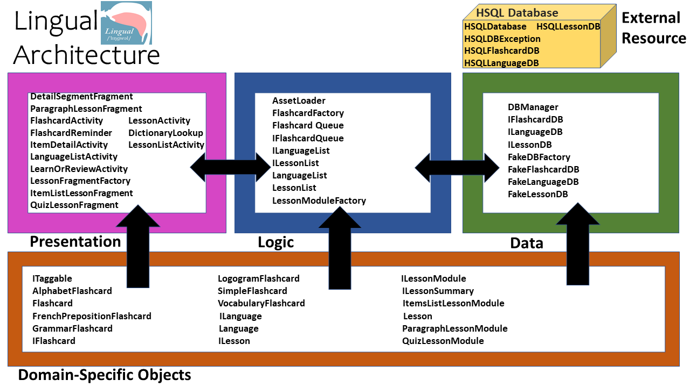

## **Lingual Architecture**

### Architecture Description
For this project, we are using the n-tier architecture where n=3. The n-tier architecture is a pattern based architecture where code is separated into different tiers/layers. Each layer has one responsibility, and the different layers communicate with each other via various method calls. These layers consist of:

**0. Domain-Specific Objects**

  Domain-Specific-Objects are a key feature of the program that goes across all of the layers in the n-tier architecture. An example of a DSO in this project would be a `Language`.

**1. UI/Presentation**

The User-Interface layer contains all the UI elements for the app and any other presentation-related features. For example, a user can learn a `Language` by interacting with the interface.

**2. Logic**

The Logic layer consists of all the logic needed to make the app output specific behaviour. It contains the rules and constraints needed to manipulate the state of the application. For example, we can ask, is the user currently learning this `Language`?

**3. Data**

The Data Layer is the place where any data is stored. The data is stored for the long-term, ie over multiple restarts of the app. For example, the type of `Language` (ex. Japanese) is stored.

### Structure
 The package structure used for the Lingual app matches the described architecture.

 Excluding the default android studio project resources and files, the source code files of this project are structured with two parallel source directories one for the applications and one for its tests.

 The root source directory contains 2 sub-directories: `main` (for the system) and `test` (for the tests).

### main
The `main` directory then contains `AndroidManifest.xml` which runs the main app activities as well as the subfolders `java` and `res`. The `res` (resource) folder mostly contains .xml files to describe the structure and layout of the application. The `java` sub-folder then contains a path `com/group5/lingual/` to indicate the name and affiliation of the project in regards to the *com.devname.appname* standard practice which represents a reverse URL of a domain name that could be purchased to host the project. Finally, within this path are 5 packages for the 4 different layers of the architecture specification as well as an external database that contain the following list of source code files:

`com.group5.lingual.dso`
- `ILanguage.java`
- `ILesson.java`
- `ITaggable.java`
- `Language.java`
- `Lesson.java`
- `AlphabetFlashcard.java`
- `Flashcard.java`
- `FrenchPrepositionFlashcard.java`
- `GrammarFlashcard.java`
- `IFlashcard.java`
- `LogogramFlashcard.java`
- `SimpleFlashcard.java`
- `VocabularyFlashcard.java`
- `ILessonModule.java`
- `ILessonSummary.java`
- `ItemsListLessonModule.java`
- `ParagraphLessonModule.java`
- `QuizLessonModule.java`

`com.group5.lingual.presentation`
- `FlashcardActivity.java`
- `FlashcardReminder.java`
- `LanguageListActivity.java`
- `LearnOrReviewActivity.java`
- `LessonActivity.java`
- `LessonListActivity.java`
- `ItemDetailActivity.java`
- `DictionaryLookup.java`
- `DetailSegmentFragment.java`
- `ParagraphLessonFragment.java`
- `ItemListLessonFragment.java`
- `QuizLessonFragment.java`
- `LessonFragmentFactory.java`

`com.group5.lingual.logic`
- `AssetLoader.java`
- `FlashcardQueue.java`
- `IFlashcardQueue.java`
- `ILanguageList.java`
- `ILessonList.java`
- `LanguageList.java`
- `LessonList.java`
- `FlashcardFactory.java`
- `LessonModuleFactory.java`

`com.group5.lingual.data`.
- `DBManager.java`
- `IFlashcardDB.java`
- `ILanguageDB.java`
- `ILessonDB.java`
- `FakeDBFactory.java`
- `FakeFlashcardDB.java`
- `FakeLanguageDB.java`
- `FakeLessonDB.java`

`com.group5.lingual.hsqldb`.
- `HSQLDatabase.java`
- `HSQLDBException.java`
- `HSQLFlashcardDB.java`
- `HSQLLanguageDB.java`
- `HSQLLessonDB.java`

### test
The `test` directory contains the same path as the `main` directory, a `java` folder containing `com/group5/lingual/`. Currently, within this path are then the folders `data`, `dso`, and `logic` that correspond to the same packages as those in the `main` directory as well as contains the test suite `AllTests.java` which runs all of the tests made for the application. Each of the listed packages contain files that run the unit tests for a source code file of the same package using the Junit test framework, applying Junit 4.

### Diagram
A diagram summarizing our architecture:

.
