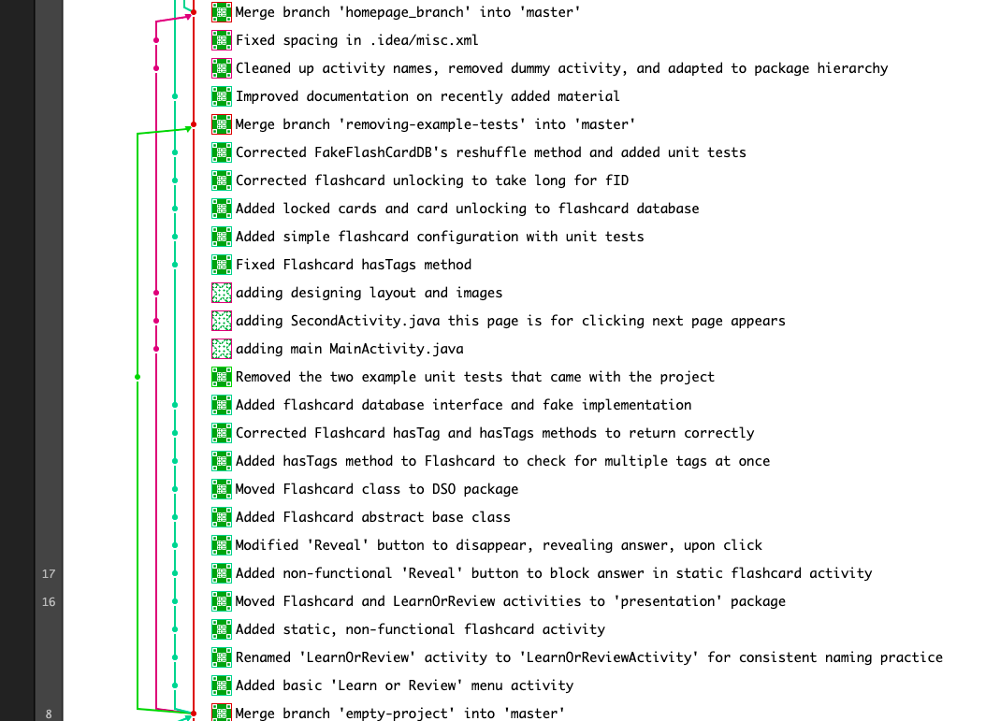

Iteration 1 Worksheet
=====================

Adding a feature
-----------------

Tell the story of how one of your features was added to the project.
Provide links to the
feature, user stories, and merge requests (if used), associated tests, and merge commit
that was used complete the feature.
Use one or two paragraphs which can have point-form within them.

One of our features is to be able to have the user review things previously learned. Before creating the feature we had to decide how our flashcard system will be able to test the user. As a group we all agreed that having flashcards would be the best way for a user to review. We then implemented a FlashcardActivity layout that suited our plan and also implemented a Flashcard class to hold the questions and answers that would help the user review. After creating the FlashcardActivity layout and Flashcard class we then implemented two databases, IFlashcardDB and FakeFlashcardDB, that would hold the flashcards. There was very little logic, as the arrangement of the contents of the database determines how the order the user receives the cards. Once LanguageListActivity was added, we needed to add support for different languages to have different card queues so we Implemented a Language class and database and generalised the language list. We then added filtering by Language ID to the Flashcard database. Finally we polished the system by disabling the review button when no flashcards are available, and adding counters for the number of cards in total and remaining.

*Links*

Feature: #5

User Stories: #18, #13

Dev Tasks: #44, #45, #53, #54, #57, #55, #56

Merge Requests: !5, !6

Tests:

* [.data.FakeFlashcardDBTest](/app/src/test/java/com/group5/lingual/data/FakeFlashcardDBTest.java)

* [.data.FakeLanguageDBTest](/app/src/test/java/com/group5/lingual/data/FakeLanguageDBTest.java)

* [.dso.flashcards.SimpleFlashcardTest](/app/src/test/java/com/group5/lingual/dso/flashcards/SimpleFlashcardTest.java)

* [.dso.LanguageTest](/app/src/test/java/com/group5/lingual/dso/LanguageTest.java)

* [.logic.FlashcardQueueTest](/app/src/test/java/com/group5/lingual/logic/FlashcardQueueTest.java)

* [.logic.LanguageListTest](/app/src/test/java/com/group5/lingual/logic/LanguageListTest.java)

Exceptional code
----------------

Provide a link to a test of exceptional code. In a few sentences,
provide an explanation of why the exception is handled or thrown
in the code you are testing.

Class:	.data.FakeFlashcardDB

Method:	void addCard(Flashcard)

[Link](/app/src/main/java/com/group5/lingual/data/FakeFlashcardDB.java)

The flashcard database relies on each flashcard having a unique Flashcard ID number. To enforce this, the fake flashcard database maintains a HashSet of all of the used ID numbers. Then, when a flashcard is added, if the new card's ID number matches an existing card, the method throws an IllegalArgumentException. This system comes at a minor memory cost, and since it uses a HashSet, is negligible in terms of time performance.

Branching
----------

Provide a link to where you describe your branching strategy.

Provide screen shot of a feature being added using your branching strategy
successfully. The [GitLab Graph tool can do this](https://code.cs.umanitoba.ca/comp3350-summer2019/cook-eBook/-/network/develop),
as well as using `git log --graph`.

[Link to branching strategy](/docs/BRANCHING_STRATEGY.md)

Screenshot of feature being added:

SOLID
-----

Find a SOLID violation in the project of group `(n%12)+1` (group 12 does group 1).
Open an issue in their project with the violation,
clearly explaining the SOLID violation - specifying the type, provide a link to that issue. Be sure
your links in the issues are to **specific commits** (not to `main`, or `develop` as those will be changed).

Provide a link to the issue you created here.

[Link to issue created](https://code.cs.umanitoba.ca/3350-winter-2021-a01/umhub-7/-/issues/34)

Agile Planning
--------------

Write a paragraph about any plans that were changed. Did you
'push' any features to iteration 2? Did you change the description
of any Features or User Stories? Have links to any changed or pushed Features
or User Stories.

Our group had a couple of change of plans for iteration one. We have our project split so that the user can either review a language of choice or do lessons after they have choosen a language. For iteration one we had thought that we would be able to accomplish both the reivew and lesson set up but it turned out to be a much bigger task than we had thought. We stayed with our orginal plan for iteration one for all tasks included with the review setup. For the lesson side of the project we decided to push all related dev tasks to iteration two and make the lesson page and set up during iteration two. 

*Links to changes*

Features: #4, #6, #19

User Stories: #15, #16, #17, #22, #23, #24