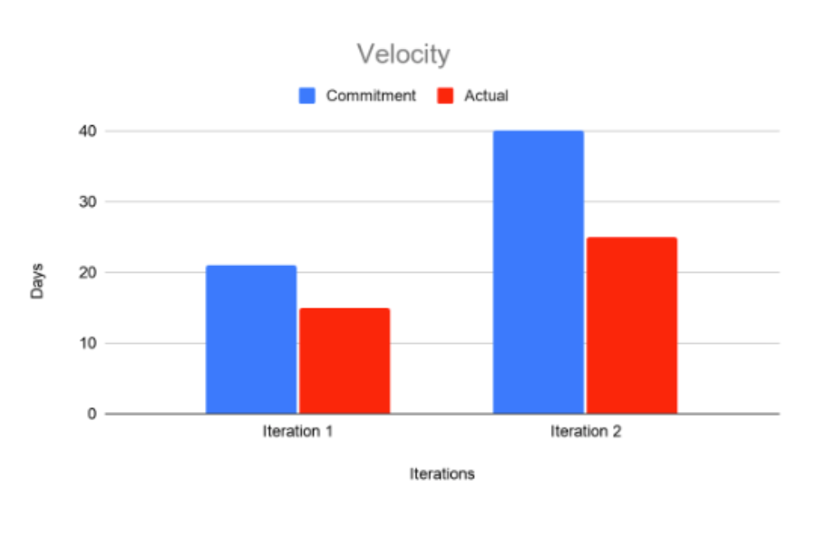

Group 5 Retrospective
=====================

From previous iterations, a problem our team has been having is not being able to complete all tasks assigned for an iteration. We believe we have been having this problem because of the dependency on another group member to finish their task. After iteration one we identified this as one of our problems as we were not able to complete about half of the tasks we had planned to complete. 
We have implemented a couple of solutions to our problem by being more mindful and playing to our team member's strong suits when assigning tasks. For example, we could not completely eliminate dependency for a few of the tasks we wanted to be completed for iteration two, so we assigned people that were able to give more time at the beginning of the iteration tasks that had other tasks dependent on them. The results of our new assignment of tasks can be seen in the velocity graph from iteration one to iteration two. We found some success in our new way of assigning tasks as we were able to increase the amount of time in iteration two but we were still not able to complete all the desired tasks. 
Our way to improve our problem of not being able to finish tasks because we were depending on other teammates for iteration three was similar to our iteration two solutions. We now have a sense of our group members' strong suits and a more realistic idea of how long tasks would take. We discussed which tasks are the highest priority and which ones we for sure want to be finished for the project. We then assigned those tasks to our group members who felt confident in being able to complete them in time. We then assigned group members who have in past iterations done more of the write-ups to do the non-technical tasks that will be required for the final iteration and presentation. 
A concrete way for our group to improve completing the tasks we want to have completed was to realistically limit our tasks to what could be done based on how much we finished in previous iterations. As a group, we are all clear about who has each task which will hold us accountable to complete it for the best interest of our group. Our group's success will be measured if we all complete the tasks we were assigned. We will also measure success if we are able to complete 29 hours or more of work for this iteration. 
As a group, we discussed that at the very least we would like our app to let a user choose a language, choose to review or learn, and then be able to successfully review or learn. What we need to complete to reach that goal is to implement the learn option and create lessons for the user to use. If we can successfully complete the learn part of our app then we agreed our app will meet our goal of success.

Velocity Graph
==============

